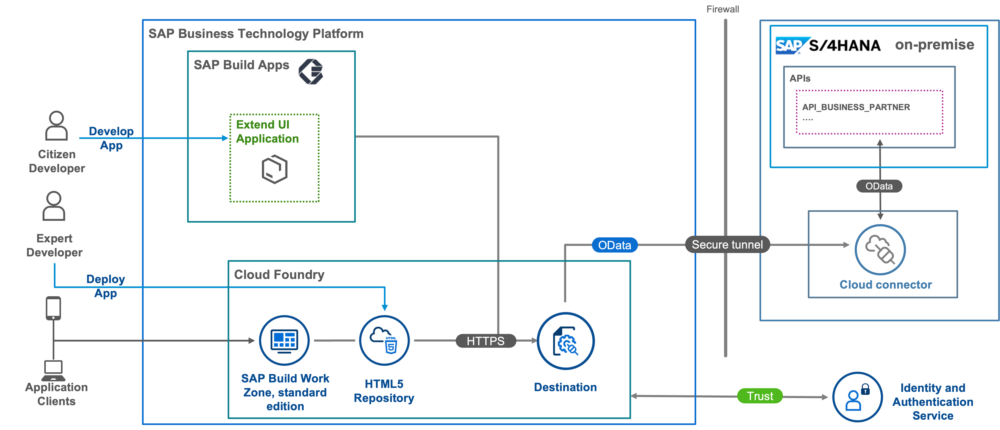

# Integrate SAC Analytics Forecast with BTP Extension Application

This scenario is primarily intended to demonstrate how to integrate BTP extension application with analytics capabilities like reports, interactive dashboards, and visuals.

By the end of this scenario, you'll be able to :

* Customize  an extension application on BTP  using calculation views  within SAP Business Application Studio.
* Set up a Live Data Connection from SAP Analytics Cloud to SAP HANA Cloud with SSO (Single Sign On) in a few steps to access application data in real time without  having to set up the SAP HANA Analytics Adapter.
* Use SAP Analytics Cloud as One Stop tool to build, analyze and forecast business data
* Use one central point to access your application and analytics from SAP Build Work Zone, standard edition with rendering on different devices.

You can find this scenario as a mission in [SAP Discovery Center](https://discovery-center.cloud.sap/missiondetail/4024/4228/).

## Business Scenario

This scenario meants to guide Business Analysts without deep statistical knowledge through the steps to perform a risk analysis forecast for a food delivery service with several vendors, delivering food to the company's customers.

When service delivery issues arise, such as late deliveries, or goods delivered in unacceptable conditions to customers, risk manager John calculates the risk cost for each vendor, using a risk management application built on SAP BTP.

## Solution Architecture

**SAP S/4HANA Cloud**

 

**SAP S/4HANA on-premise**

 

## Discover

* [The Mission Story](discover/business-story.md)
* [Learn the Basics of SAP BTP](https://github.com/SAP-samples/cloud-extension-html5-sample/blob/mission/mission/discover/BTP.md)
* [Learn About SAP S/4HANA](https://github.com/SAP-samples/cloud-extension-html5-sample/blob/mission/mission/discover/S4H.md)
* [Learn About SAP S/4HANA Cloud](./discover/S4HC.md)
* [Learn About HTML5 Applications](https://github.com/SAP-samples/cloud-extension-html5-sample/blob/mission/mission/discover/HTML5.md)
* [Learn About SAP Build Apps](./discover/AppGyver.md)
* [Learn About SAP Cloud Identity Services](https://github.com/SAP-samples/cloud-extension-html5-sample/blob/mission/mission/discover/IAS.md)
* [Learn About SAP Work Zone](https://github.com/SAP-samples/cloud-extension-html5-sample/blob/mission/mission/discover/Launchpad.md)

## Landscape Setup for SAP BTP and SAP S/4HANA Cloud

  - [Set up the SAP Build Apps Service](./setup/btp/SAPBUILD.md)
  - [Assign roles for SAP Build Work Zone, standard edition](./setup/launchpad/README.md)
  - [Onboard SAP S/4HANA Cloud System](./setup/s4hc-onboarding/README.md)
  - [Configure Communication Settings in SAP S/4HANA Cloud](./setup/s4hc-setup/setup-s4hc-system.md)
  - [Configure End-to-End Communication from SAP BTP to SAP S/4HANA Cloud System](./connectivity/end-to-end-connection.md)
  
## Landscape Setup for SAP BTP and SAP S/4HANA on-premise
  - [OPTIONAL: Create an SAP S/4HANA Test System using the SAP Cloud Appliance Library](https://github.com/SAP-samples/cloud-extension-ecc-business-process/blob/mission/mission/cal-setup/CALS4H.md)
  - [Set up the SAP Build Apps Service](./setup/btp/SAPBUILD.md)
  - [Assign roles for SAP Build Work Zone, standard edition](./setup/launchpad/README.md)
  - [Set up the SAP S/4HANA on-premise System](https://github.com/SAP-samples/cloud-extension-html5-sample/blob/mission/mission/s4h-setup/README.md)
  - [Set up the SAP Cloud Connector & Trust to the SAP S/4HANA System](https://github.com/SAP-samples/cloud-extension-html5-sample/blob/mission/mission/cloud-connector/README.md)
  - [Configure End-to-End Connectivity from SAP BTP to SAP S/4HANA System](./connectivity/s4hpp-connection.md)
  - [Configure Single Sign-On between SAP S/4HANA and SAP BTP](https://github.com/SAP-samples/cloud-extension-html5-sample/blob/mission/mission/custom-idp/README.md)
  
  
## Landscape Setup for SAP BTP and Mock Server

If you don't have an SAP S/4HANA system, you can use a mock server setup instead.

  - [Set up the SAP Build Apps Service](./setup/btp/SAPBUILD.md)
  - [Assign roles for SAP Build Work Zone, standard edition](./setup/launchpad/README.md)
  - [Install Mock Server](./setup/mock/README.md)

## Implementation of an SAP Build Apps Extension Application

Once you have set up the landscape, you can develop, test, and run a simple UI application. We will show the steps to implement the simple UI application using the SAP BTP-managed HTML5 repository. This is a kind of PoC to see if and how the whole landscape setup is working.

* Develop a simple UI application:
  * [Create a No-Code Application with SAP Build Apps](./create-application/develop/README.md)
  * [Create a Business Partner List Page](./create-application/develop/ListPage/README.md)
  * [Create a Business Partner Details Page](./create-application/develop/DetailsPage/README.md)
  * [Build and Deploy Your SAP Build Apps Application to SAP BTP](./create-application/deploy/README.md)
  * [Integrate the Application with SAP Build Work Zone, standard edition](./create-application/workzone/README.md)

## How to Obtain Support

[Create an issue](https://github.com/SAP-samples/btp-s4hana-nocode-extension/issues) in this repository if you find a bug or have questions about the content.

For additional support, [ask a question in SAP Community](https://answers.sap.com/questions/ask.html).

## Contributing

If you wish to contribute code, offer fixes or improvements, please send a pull request. Due to legal reasons, contributors will be asked to accept a DCO when they create the first pull request to this project. This happens in an automated fashion during the submission process. SAP uses [the standard DCO text of the Linux Foundation](https://developercertificate.org/).

## License

Copyright (c) 2022 SAP SE or an SAP affiliate company. All rights reserved. This project is licensed under the Apache Software License, version 2.0 except as noted otherwise in the [LICENSE](LICENSE) file.
