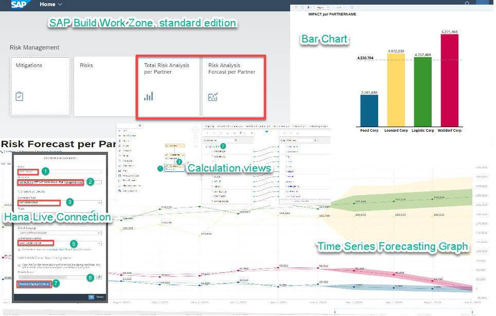
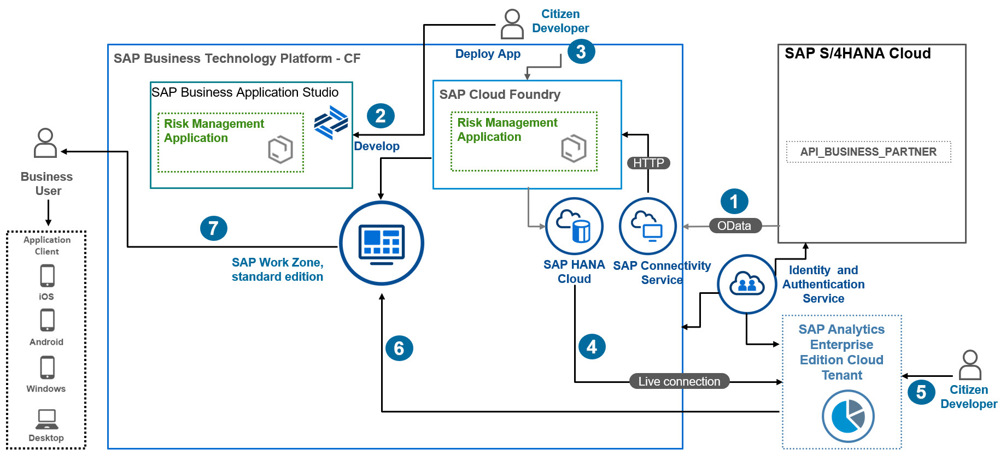

# The Mission Story

This scenario is primarily intended to demonstrate how to integrate BTP extension application with analytics capabilities like reports, interactive dashboards, and visuals.

By the end of this scenario, you'll be able to :

* Customize  an extension application on BTP  using calculation views  within SAP Business Application Studio.
* Set up a Live Data Connection from SAP Analytics Cloud to SAP HANA Cloud with SSO (Single Sign On) in a few steps to access application data in real time without  having to set up the SAP HANA Analytics Adapter.
* Use SAP Analytics Cloud as One Stop tool to build, analyze and forecast business data
* Use one central point to access your application and analytics from SAP Build Work Zone, standard edition with rendering on different devices.

## Business Scenario

This scenario meants to guide Business Analysts without deep statistical knowledge through the steps to perform a risk analysis forecast for a food delivery service with several vendors, delivering food to the company's customers.

When service delivery issues arise, such as late deliveries, or goods delivered in unacceptable conditions to customers, risk manager John calculates the risk cost for each vendor, using a risk management application built on SAP BTP.

## Solution Architecture

 
